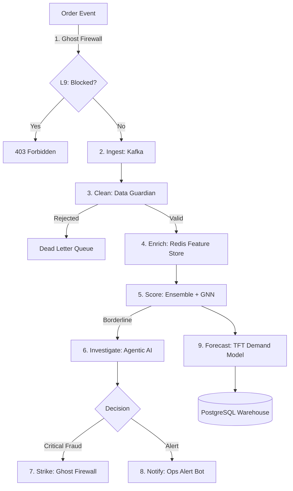

# 🛒 Real-Time E-Commerce Order Analytics Pipeline

> A production-grade data engineering project that ingests live e-commerce orders, detects fraudulent transactions using ML, forecasts demand, and delivers real-time business insights through a unified dashboard.

---

## 📌 Problem Statement

Large e-commerce platforms like Flipkart, Amazon, and Meesho process thousands of orders every minute. Without a real-time data infrastructure, these companies face four critical problems:

| # | Problem | Business Impact |
|---|---------|----------------|
| 1 | **Fraud Orders** — Stolen cards, fake accounts, and bot orders go undetected until damage is done | Revenue loss, chargebacks |
| 2 | **No Live Visibility** — Business teams only see yesterday's reports, not what's happening right now | Missed decisions, slow response |
| 3 | **Demand Unpredictability** — Products go out of stock during sales events like Big Billion Days | Lost revenue, poor customer experience |
| 4 | **Scattered Data** — Order data sits across 10+ systems with no unified pipeline | Inconsistent reporting, data silos |

---

## ✅ Solution

This project builds an **end-to-end real-time data pipeline** that:

- 🔴 **Ingests** live order events using Apache Kafka
- ⚡ **Processes** streams in real time using Apache Spark Structured Streaming
- 🤖 **Detects fraud** using an ML model (Isolation Forest) served via FastAPI
- 📈 **Forecasts demand** using a time-series model (Prophet / LSTM)
- 🗄️ **Stores** processed data in PostgreSQL and raw data in AWS S3 / Delta Lake
- 🔁 **Orchestrates** workflows and retraining jobs using Apache Airflow
- 📊 **Visualizes** live metrics in a Grafana dashboard

---

## 🏗️ Architecture

```
┌─────────────┐     ┌───────────┐     ┌──────────────────┐     ┌─────────────┐
│ Order        │────▶│   Kafka   │────▶│  Spark Streaming │────▶│  PostgreSQL │
│ Generator    │     │  Broker   │     │  + ML Inference  │     │  / AWS S3   │
└─────────────┘     └───────────┘     └──────────────────┘     └──────┬──────┘
                                               │                        │
                                       ┌───────▼───────┐      ┌────────▼───────┐
                                       │  FastAPI ML   │      │    Airflow     │
                                       │  Server       │      │  Orchestrator  │
                                       │  (Fraud/      │      │  (Batch Jobs / │
                                       │   Forecast)   │      │   Retraining)  │
                                       └───────────────┘      └────────┬───────┘
                                                                        │
                                                               ┌────────▼───────┐
                                                               │    Grafana     │
                                                               │   Dashboard    │
                                                               └────────────────┘
```

---

## 🔧 Tech Stack

| Layer | Technology |
|-------|-----------|
| Data Generation | Python (Faker library) |
| Message Broker | Apache Kafka |
| Stream Processing | Apache Spark Structured Streaming |
| ML Models | Scikit-learn (Isolation Forest), Prophet / LSTM |
| Model Serving | FastAPI |
| Storage (Structured) | PostgreSQL |
| Storage (Raw/Archive) | AWS S3 + Delta Lake |
| Orchestration | Apache Airflow |
| Visualization | Grafana |
| Containerization | Docker + Docker Compose |
| Model Registry | MLflow |

---

## 📂 Project Structure

```
realtime-ecommerce-pipeline/
│
├── producer/                    # Generates & sends fake orders to Kafka
├── kafka/                       # Kafka configuration & topic setup
├── spark/                       # Spark streaming & transformations
├── ml/
│   ├── train/                   # Model training scripts
│   ├── serve/                   # FastAPI inference server
│   └── models/                  # Saved model files (.pkl)
├── storage/                     # PostgreSQL & S3 writers
├── airflow/
│   └── dags/                    # Pipeline, forecast & retraining DAGs
├── dashboard/                   # Grafana configs & SQL queries
├── tests/                       # Unit & integration tests
├── docker/                      # Dockerfiles & docker-compose
├── docs/                        # Architecture diagram & setup guide
├── requirements.txt
├── .env
└── README.md
```

---

## 🧠 Fraud Intelligence System (Real-Time)

We have upgraded from a simple Isolation Forest to a State-of-the-Art **4-Layer Fraud Roadmap**:

| Layer | Component | Technology | Description | Status |
|-------|-----------|------------|-------------|--------|
| **L1** | **Ring Detection** | GNN (GraphSAGE) | Detects fraud rings by connecting orders sharing IP/Device. | ✅ 100% |
| **L2** | **Agentic AI** | LangGraph | Borderline cases trigger an AI Investigator for evidence research. | ✅ 100% |
| **L3** | **Feature Store** | Redis | sub-3ms lookup of user reputation and real-time velocity. | ✅ 100% |
| **L4** | **Demand Forecast** | **TFT (Transformer)** | Upgraded Prophet to Deep Learning Temporal Fusion Transformer. | ✅ 100% |
| **L5** | **MLOps & A/B** | **Shadow Testing** | Real-time Challenger vs Champion scoring & Drift detection. | ✅ 100% |
| **L6** | **Security & Compliance** | **SHA-256 Hashing** | Integrated PII masking and Secret Manager for GDPR readiness. | ✅ 100% |
| **L7** | **Data Guardian** | **Dead Letter Queue** | Real-time schema enforcement and anomalous data routing. | ✅ 100% |
| **L8** | **Ops Alerting** | **Slack/Webhook** | Real-time notifications for CRITICAL fraud rings. | ✅ 100% |
| **L9** | **Ghost Firewall** | **Auto-Blocking** | Real-time IP blacklisting for CRITICAL threats. | ✅ 100% |

### Prediction Workflow (Final v7.0):
1. **Defend**: **Ghost Firewall (L9)** checks Redis for blacklisted IPs before even running the ML code.
2. **Ingest**: Valid requests hit Spark, which triggers the **Data Guardian (L7)**.
3. **Filter**: Valid data proceeds; Anomalous data is routed to the **DLQ (L7)**.
4. **Inference**: FastAPI enriches the order with **L3 (Redis)** features.
5. **Score**: Dual-scoring with **L1 (Ensemble)** and **L1 (GNN)** in Shadow mode.
6. **Investigate**: If borderline, **L2 (Agentic AI)** performs LangGraph research.
7. **Strike**: If **CRITICAL**, **Ghost Firewall (L9)** blacklists the IP and **Alert Bot (L8)** notifies the team.

---

## 📊 Dashboard Metrics (Grafana)

- ✅ Live order count (per minute)
- ✅ Revenue by region (real-time)
- ✅ Fraud alerts feed
- ✅ Top products by order volume
- ✅ Demand forecast chart (next 6 hours)

---

## 👥 Stakeholder Impact

| Data Team | Clean, unified, reliable pipeline replacing data silos |
|------------|---------|

---

## 🛡️ The 9-Layer Fraud Intelligence Shield



---

## 🛠️ Market Integration API

### `POST /predict`
The primary endpoint for fraud intelligence.
- **Security**: Requires `X-API-KEY`.
- **Latency Target**: 50ms - 200ms (depending on Layer 2 triggers).

| Parameter | Type | Description |
|-----------|------|-------------|
| `order_id` | string | Unique transaction ID |
| `order_amount` | float | Total value in USD |
| `ip_address` | string | Origin IPv4/IPv6 |

### `POST /forecast`
Predicts category-level demand for the next 24 hours.
- **Model**: Temporal Fusion Transformer (TFT).

---

## 🚀 Production Quickstart (Day 1)

1. **Environmental Audit**:
   Run the system check to verify Kafka, Redis, and Postgres are active:
   ```bash
   python scripts/init_system.py
   ```

2. **Start the Intelligence API**:
   ```bash
   cd ml/serve && uvicorn app:app --host 0.0.0.0 --port 8000
   ```

3. **Deploy Spark Stream on Databricks**:
   Refer to the [databricks_migration_guide.md](./databricks_migration_guide.md).

---

## 🚀 Getting Started

### Prerequisites
- Docker & Docker Compose
- Python 3.9+
- AWS Account (for S3, optional)

### Run Locally

```bash
# Clone the repository
git clone https://github.com/your-username/realtime-ecommerce-pipeline.git
cd realtime-ecommerce-pipeline

# Set up environment variables
cp .env.example .env

# Start all services (Kafka, Spark, PostgreSQL, Airflow)
docker-compose up -d

# Start the order producer
python producer/order_producer.py

# Start the ML serving API
uvicorn ml/serve/app:app --reload --port 8000

# Access Grafana dashboard
open http://localhost:3000
```

---

## 📈 Skills Demonstrated

`Apache Kafka` `Apache Spark` `PySpark` `Apache Airflow` `FastAPI` `Scikit-learn` `Prophet` `PostgreSQL` `AWS S3` `Delta Lake` `MLflow` `Docker` `Grafana` `ETL` `Real-Time Processing` `MLOps`

---

## 🙋 Author

**Your Name**
- LinkedIn: [linkedin.com/in/yourprofile](#)
- GitHub: [github.com/yourusername](#)

---

> ⭐ If you found this project useful, consider giving it a star!