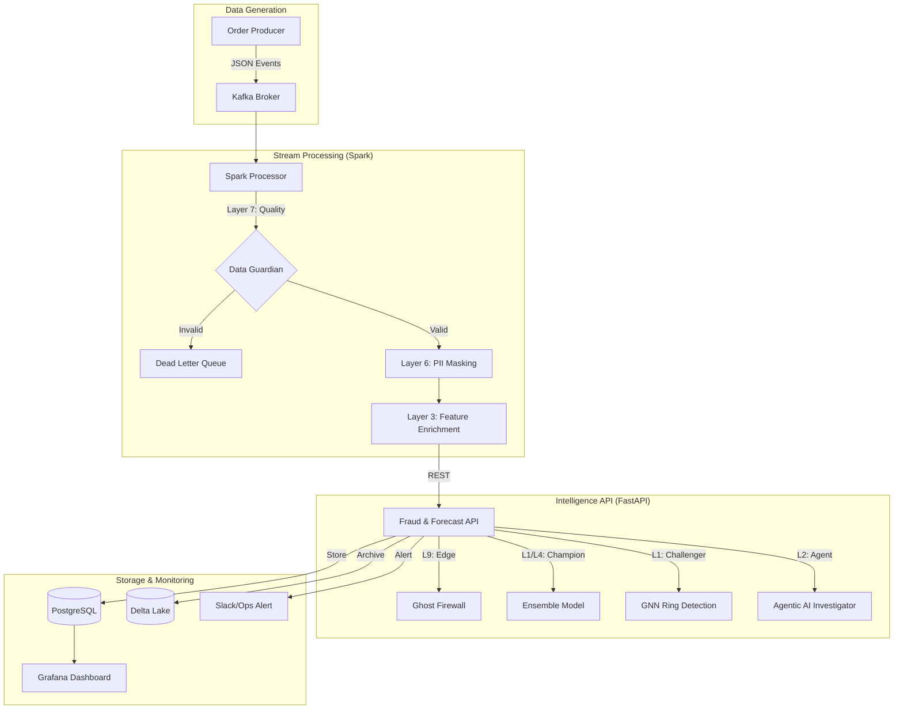

# 🛒 Real-Time E-Commerce Fraud & Demand Intelligence Pipeline

> A production-grade Data Engineering & MLOps ecosystem that ingests live order streams, detects fraudulent transactions using a multi-layer intelligence shield, and forecasts product demand using Deep Learning.

---

## 📌 The Problem: "The Visibility Gap"

In high-volume E-commerce (Flipkart, Amazon), thousands of transactions occur every second. Traditional batch processing leaves companies vulnerable to:
- **Instant Fraud**: Bot attacks and stolen cards go undetected for hours.
- **Stock-Outs**: Demand spikes (e.g., during "Big Billion Days") are missed in real-time.
- **PII Exposure**: Lack of automated masking in streaming leads to compliance risks.

---

## ✅ The Solution: A Reactive Intelligence Shield

This project implements a **10-Layer Reactive Pipeline** that bridges the gap between raw data and actionable intelligence.

- 🔴 **Ingestion**: Live order events via **Apache Kafka**.
- ⚡ **Processing**: Real-time ETL and schema enforcement via **Spark Structured Streaming**.
- 🤖 **Fraud Shield**: A sophisticated ensemble of GNNs, Agentic AI, and Shadow Testing.
- 📈 **Forecasting**: Temporal Fusion Transformers (TFT) for sub-hour demand prediction.
- 🗄️ **Storage**: **PostgreSQL** for operational metrics and **Delta Lake** for the raw data lake.
- 🔁 **Orchestration**: **Apache Airflow** managing model retraining and backfills.
- 📊 **Visibility**: **Grafana** providing real-time P99 latency and fraud distribution metrics.

---

## 🏗️ System Architecture



---

## 🛡️ The 10-Layer Fraud Intelligence Shield

This project implements a state-of-the-art security roadmap:

| Layer | Component | Technology | Description |
|-------|-----------|------------|-------------|
| **L1** | **Ring Detection** | **GNN (PyTorch)** | Detects fraud rings by analyzing device/IP connection graphs. |
| **L2** | **Agentic AI** | **LangGraph** | Borderline cases trigger an AI Investigator to research evidence. |
| **L3** | **Feature Store** | **Redis** | <3ms lookup of user velocity and historical reputation. |
| **L4** | **Demand Forecast** | **TFT (Deep Learning)** | Deep Learning Temporal Fusion Transformer for demand prediction. |
| **L5** | **Shadow Testing** | **MLOps Pipeline** | Champion vs Challenger scoring to validate new models in production. |
| **L6** | **Security** | **SHA-256 Hashing** | Real-time PII masking of IP addresses and User IDs in Spark. |
| **L7** | **Data Guardian** | **Schema Guard** | Real-time validation; anomalous data is routed to a Dead Letter Queue. |
| **L8** | **Ops Alerting** | **Webhooks** | Automated Slack/System alerts for High-Risk fraud triggers. |
| **L9** | **Ghost Firewall** | **Auto-Blocking** | Real-time IP blacklisting for critical threats in Redis. |
| **L10** | **Precision Attribution** | **SHAP/Attribution** | Identifies the top 3 drivers for every fraud decision. |

---

## ⚡ Production-Grade MLOps & Model Hardening

The machine learning architecture has been hardened to eliminate data leakage and support real-world validation:

- **Chronological Split & Kaggle Benchmark**: Transitioned from synthetic validation to the **1.5M+ row Kaggle "Fraudulent E-Commerce Transactions" dataset**. Instead of a random split (which leaks future behavior), we enforce a chronological holdout split (80% train / 20% test).
- **Zero-Leakage Feature Store**: Training statistics, category encoders, and historical fraud sets are calculated solely on the training partition and serialized. At serve-time, the FastAPI prediction loop fetches running user statistics (e.g. `avg_order_value_usd`) from **Redis (Layer 3)** to compute features like `amount_zscore_user` on a single-row request without look-ahead bias.
- **Business Cost-Aware Threshold Optimization**: Instead of maximizing F1 (which weights False Positives and False Negatives equally), the decision threshold is dynamically tuned to minimize business loss ($80 per False Positive customer friction vs. transaction amount + $20 chargeback fee per False Negative).
- **Dynamic GNN Graph Builder**: Rather than passing a single detached node to the GraphSAGE model, a background worker (`update_gnn_graph_and_scores`) retrieves the last 50 transactions from Redis, constructs a real connected graph (orders sharing the same IP or User ID), runs GNN inference, and caches scores back to Redis for low-latency A/B testing.
- **Factual Drift Monitoring**: Upgraded from dummy drift logs to a production-grade comparison. During training, a 5,000-row feature sample (`reference_data.csv`) and a summary statistics JSON are generated. In production, live inferences are logged to `production_predictions.csv` and analyzed via **Evidently (Layer 5)** using Kolmogorov-Smirnov and Wasserstein distance tests to generate interactive HTML reports.

---

## 📂 Project Structure

```text
.
├── airflow/                    # Airflow DAGs for forecasting & retraining
├── config/                     # Shared configurations (Secrets, etc.)
├── dashboard/                  # Grafana dashboards & SQL schemas
├── docker/                     # Docker Compose & container definitions
├── kafka/                      # Kafka topic setup & config
├── ml/                         # The Intelligence Engine
│   ├── agents/                 # L2: Agentic AI (LangGraph)
│   ├── mlops/                  # L5: Shadow testing & Drift detection
│   ├── models/                 # Serialized model artifacts (.pkl, .pt)
│   ├── ops/                    # L8/L9: Alerts & Ghost Firewall
│   ├── serve/                  # FastAPI inference server
│   └── train/                  # Model training (Ensemble, GNN, TFT)
├── producer/                   # Synthetic order generator (Faker)
├── scripts/                    # System initialization & utility scripts
├── spark/                      # Spark Structured Streaming logic
├── storage/                    # Database init & Feature Store setup
└── tests/                      # Integration & Unit tests
```

---

## 🚀 Quickstart

### 1. Environment Setup
Clone the repo and initialize environment variables:
```bash
git clone https://github.com/ankushsingh003/Fake-Order-E-COMMERCE.git
cd Fake-Order-E-COMMERCE
cp .env.example .env
```

### 2. Launch Infrastructure
Start the Kafka, Redis, Postgres, and Spark cluster:
```bash
docker-compose -f docker/docker-compose.yml up -d
```

### 3. Initialize Databases
Run the setup scripts to prepare PostgreSQL and the Redis Feature Store:
```bash
python scripts/init_system.py
```

### 4. Start the Intelligence API
```bash
cd ml/serve
uvicorn app:app --host 0.0.0.0 --port 8000
```

### 5. Start the Data Pipeline
In a new terminal, start the Spark Streaming processor:
```bash
python spark/spark_processor.py
```

### 6. Generate Live Orders
```bash
python producer/order_producer.py
```

---

## 📊 Skills Demonstrated

- **Streaming**: Apache Kafka, Spark Structured Streaming, PySpark.
- **MLOps**: MLflow, Shadow Deployment, Drift Detection, Feature Stores (Redis).
- **Deep Learning**: PyTorch (GNN), PyTorch Forecasting (TFT).
- **Agentic AI**: LangGraph, LLM-based investigation.
- **Data Engineering**: PostgreSQL, Delta Lake, Airflow, Docker.
- **Observability**: Grafana, Prometheus, Structured Logging.

---

## 🙋 Author

**Ankush Kumar Singh**
- GitHub: [@ankushsingh003](https://github.com/ankushsingh003)
- LinkedIn: [Ankush Kumar Singh](https://www.linkedin.com/in/ankushsingh003/)

---

> ⭐ If you found this project useful, consider giving it a star!
